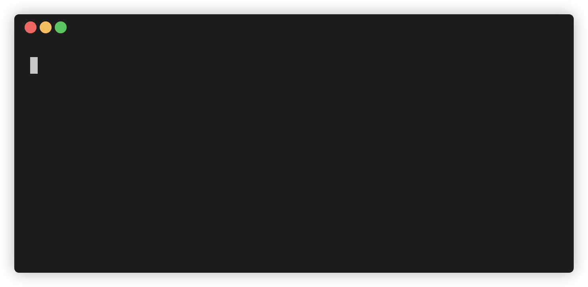
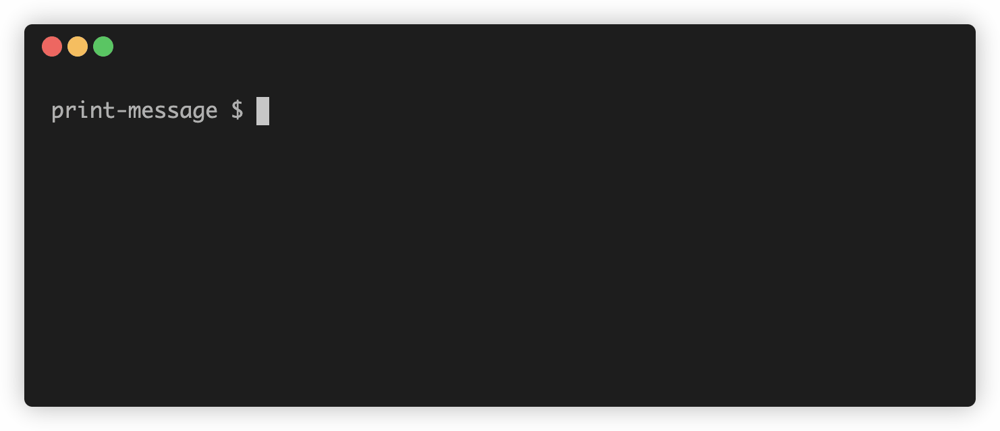

<h1 align="center">
	<br />
	<br />
	
	<br />
	<br />
</h1>

[](https://github.com/goliney/garson/actions/workflows/main.yml)
[](https://www.npmjs.com/package/garson)

Build interactive config-based command-line interfaces with JavaScript :wink:


## Table of Contents

- [Install](#install)
- [Usage](#usage)
  * [As a global dependency](#as-a-global-dependency)
  * [As a local dependency](#as-a-local-dependency)
- [Configuration](#configuration)
- [Prompts](#prompts)
  * [Input `prompts.input()`](#input-promptsinput)
  * [Fuzzy path search `prompts.fuzzyPath()`](#fuzzy-path-search-promptsfuzzypath)
  * [Choices `prompts.choices()`](#choices-promptschoices)
  * [Multi choices `prompts.multiChoices()`](#multi-choices-promptsmultichoices)
- [Actions](#actions)
  * [Print message `actions.printMessage()`](#print-message-actionsprintmessage)
  * [Spawn `actions.spawn()`](#spawn-actionsspawn)
- [Build your own binary](#build-your-own-binary)


## Install

```shell script
npm install garson
```

## Usage

### As a global dependency
Run:
```shell script
npx garson
```
This command will look for `garson.config.js` file in the current directory.
You can change the default path with `--config` option.

See `npx garson --help` for a full list of options.

### As a local dependency
Create a script in package.json:
```json
{
  "scripts": {
    "garson": "garson --config=./path-to/garson.config.js"
  }
}
```
Now you can run `npm run garson`.

## Configuration

A `garson.conf.js` file should export a garson object, which is represented by
a chain of prompts that ends with an action:
```js
const { garson, prompts, actions } = require('garson');

module.exports = garson()
  .prompt(/* some prompt */)
  .action(/* some action  */);
```

There could be many prompts, but they must end with a single action:
```js
const { garson, prompts, actions } = require('garson');

module.exports = garson()
  .prompt(/* some prompt */)
  .prompt(/* another prompt */)
  .prompt(/* one more prompt */)
  .action(/* the only action  */); // you can't chain anything to .action()
```

It's possible to return another garson object from the action callback:
```js
const { garson, prompts, actions } = require('garson');

const branchA = garson()
  .prompt(/* branch A prompt */)
  .action(/* branch A action */);

const branchB = garson()
  .prompt(/* branch B prompt */)
  .action(/* branch B action */);

module.exports = garson()
  .prompt(/* prompt */)
  .action(results => {
    if (results.someKey) {
      return branchA; // will show branch A prompt and then branch A action
    } else {
      return branchB; // will show branch B prompt and then branch B action
    }
  });
```

## Prompts

Each `.prompt()` takes two arguments:
 1. prompt key
 2. prompt object

Prompt key is needed to define a property in the result object which is passed
into an action callback. Prompt objects defines a type of a prompt.

### Input `prompts.input()`

Provides a text input.

<table>
  <thead>
   <tr>
     <th>Property name</th>
     <th>Type</th>
     <th>Required</th>
     <th>Description</th>
   </tr>
 </thead>
 <tbody>
   <tr>
     <td>message</td>
     <td>String</td>
     <td>No</td>
     <td>Text to display next to the input</td>
   </tr>
   <tr>
     <td>placeholder</td>
     <td>String</td>
     <td>No</td>
     <td>Text to display when the value is empty</td>
   </tr>
   <tr>
     <td>defaultValue</td>
     <td>String</td>
     <td>No</td>
     <td>Initial value of the input</td>
   </tr>
 </tbody>
</table>

Example:
```js
// garson.config.js
const { garson, prompts, actions } = require('garson');

module.exports = garson()
  // first prompt
  .prompt(
    'firstName',
    prompts.input({
      message: "What's your first name?",
      placeholder: 'E.g. John',
    })
  )
  // second prompt
  .prompt(
    'lastName',
    prompts.input({
      message: "What's your last name?",
      placeholder: 'E.g. Smith',
    })
  )
  // final action
  .action(results => {
    // note the keys of the result object
    const { firstName, lastName } = results;
    actions.printMessage({ message: `Hello, ${firstName} ${lastName}` });
  });
```


### Fuzzy path search `prompts.fuzzyPath()`

Provides a fuzzy search for a file or a folder in a specified directory.

<table>
  <thead>
   <tr>
     <th>Property name</th>
     <th>Type</th>
     <th>Required</th>
     <th>Description</th>
   </tr>
 </thead>
 <tbody>
   <tr>
     <td>message</td>
     <td>String</td>
     <td>No</td>
     <td>Text to display next to the input</td>
   </tr>
   <tr>
     <td>placeholder</td>
     <td>String</td>
     <td>No</td>
     <td>Text to display when the input value is empty</td>
   </tr>
   <tr>
     <td>pattern</td>
     <td>String</td>
     <td>No</td>
     <td>Glob pattern. Defaults to <code>'*'</code></td>
   </tr>
   <tr>
     <td>options</td>
     <td>Object</td>
     <td>No</td>
     <td>
       Options object that is passed to <code>glob</code>.
       See the full list of options <a href="https://github.com/isaacs/node-glob#options">here</a>
     </td>
   </tr>
 </tbody>
</table>

Example:
```js
// garson.config.js
const { garson, prompts, actions } = require('garson');

const cwd = '/Users/goliney/Workspace/garson/src';
module.exports = garson()
  .prompt(
    'file',
    prompts.fuzzyPath({
      message: 'Enter file:',
      pattern: '**',
      options: {
        nodir: true,
        cwd,
      },
    })
  )
  .action(results => {
    const { file } = results;
    actions.spawn(`nano ${cwd}/${file.path}`);
  });
```



### Choices `prompts.choices()`

Allows to select a value from the list.

<table>
  <thead>
   <tr>
     <th>Property name</th>
     <th>Type</th>
     <th>Required</th>
     <th>Description</th>
   </tr>
 </thead>
 <tbody>
   <tr>
     <td>message</td>
     <td>String</td>
     <td>No</td>
     <td>Text to display next to the options</td>
   </tr>
   <tr>
     <td>items</td>
     <td>Array</td>
     <td>Yes</td>
     <td>
       List of options. Each option should be an objects with <code>label</code> and <code>value</code> properties.
       Label is a string to display. Value could have any type, it gets passed into the action callback.
     </td>
   </tr>
   <tr>
     <td>isNumericInputEnabled</td>
     <td>Boolean</td>
     <td>No</td>
     <td>
       Default to false. If true, each item will have an index next to it.
       Pressing the key that matches the index will select the corresponding item.
       Note, more than 9 items is not supported
       if the <code>isNumericInputEnabled</code> mode is on.
     </td>
   </tr>
 </tbody>
</table>

Example:
```js
// garson.config.js
const { garson, prompts, actions } = require('garson');

module.exports = garson()
  .prompt(
    'command',
    prompts.choices({
      message: 'What git command you want to run?',
      items: [
        { label: 'See current branch', value: 'git branch' },
        { label: 'Checkout to master', value: 'git checkout master' },
        { label: 'See status', value: 'git status' },
      ],
    })
  )
  .action(results => {
    const { command } = results;
    actions.spawn(command, { showCommand: true });
  });
```


### Multi choices `prompts.multiChoices()`

Allows to select multiple values from the list.

<table>
  <thead>
   <tr>
     <th>Property name</th>
     <th>Type</th>
     <th>Required</th>
     <th>Description</th>
   </tr>
 </thead>
 <tbody>
   <tr>
     <td>message</td>
     <td>String</td>
     <td>No</td>
     <td>Text to display next to the options</td>
   </tr>
   <tr>
     <td>items</td>
     <td>Array</td>
     <td>Yes</td>
     <td>
       List of options. Each option should be an objects with <code>label</code> and <code>value</code> properties.
       Label is a string to display. Value could have any type, it gets passed into the action callback.
       Same as for the <code>choices</code> prompt.
     </td>
   </tr>
   <tr>
     <td>onChangeMiddleware</td>
     <td>Function</td>
     <td>No</td>
     <td>
       A callback that is fired each time user changes a selection. May be handy when you want to transform selection
       before applying. The callback receives three arguments:
       <ol>
         <li><code>newItems</code> - an array of newly selected options</li>
         <li><code>oldItems</code> - an array of previously selected options</li>
         <li><code>allItems</code> - an original array of options</li>
       </ol>
       A list returned from this callback will be used as a new selection. Returning falsy value is equal to
       returning <code>newItems</code>.
     </td>
   </tr>
 </tbody>
</table>

Example:

```js
// garson.config.js
const { garson, prompts, actions } = require('garson');

module.exports = garson()
  .prompt(
    'wcOptions',
    prompts.multiChoices({
      message: 'What do you want to count in garson.config.js file?',
      items: [
        { label: 'Lines', value: 'l', isSelected: true },
        { label: 'Words', value: 'w', isSelected: true },
        { label: 'Characters', value: 'm' },
        { label: 'Everything', value: 'lwm', isSelected: false },
      ],
      // optional handler
      onChangeMiddleware(newItems, oldItems, allItems) {
        const isEverything = item => item.value === 'lwm';
        const newItemsHaveEverythingSelected = newItems.some(isEverything);
        const oldItemsHaveEverythingSelected = oldItems.some(isEverything);

        if (newItemsHaveEverythingSelected && !oldItemsHaveEverythingSelected) {
          // if "Everything" just got selected, deselect everything else
          return allItems.filter(isEverything);
        }

        if (oldItemsHaveEverythingSelected) {
          // if "Everything" was selected, deselect it
          return newItems.filter(item => !isEverything(item));
        }

        return newItems;
      },
    })
  )
  .action(results => {
    const { wcOptions } = results;
    const options = wcOptions.length ? `-${wcOptions.join('')}` : '';
    actions.spawn(`wc ${options} ./examples/multi-choices/garson.config.js`);
  });


```


## Actions

The `action` takes a single argument - a callback which is invoked with the results of
all the prompts that were already shown.

It's up to you to decide what to do next with the result data. Since it's JavaScript environment,
your further actions are limited only by Node.

For your convenience `garson` is shipped with a couple of actions that might get handy.

### Print message `actions.printMessage()`

Shows a text message on the screen.

<table>
  <thead>
   <tr>
     <th>Property name</th>
     <th>Type</th>
     <th>Required</th>
     <th>Description</th>
   </tr>
 </thead>
 <tbody>
   <tr>
     <td>boxTitle</td>
     <td>String</td>
     <td>No</td>
     <td>Text to display above the message</td>
   </tr>
   <tr>
     <td>message</td>
     <td>String</td>
     <td>Yes</td>
     <td>Message to show</td>
   </tr>
 </tbody>
</table>

Example:
```js
// garson.config.js
const { garson, prompts, actions } = require('garson');

module.exports = garson()
  .prompt('name', prompts.input({ message: 'Name:' }))
  .action(results => {
    actions.printMessage({
      boxTitle: 'Greetings',
      message: `Hello, ${results.name}`
    });
  });
```



### Spawn `actions.spawn()`

A wrapper over Node's [`spawn`](https://nodejs.org/api/child_process.html#child_process_child_process_spawn_command_args_options).
It can get handy when you want to run a command in the terminal.

`actions.spawn` accepts two arguments:
1. A mandatory command string
2. An optional spawn options objects. See [`spawn docs`](https://nodejs.org/api/child_process.html#child_process_child_process_spawn_command_args_options)
for a full list of parameters. Optionally, you can set `{ showCommand: true }` to see the
command before executing it.

Example:
```js
// garson.config.js
const { garson, prompts, actions } = require('garson');

module.exports = garson()
  .prompt(
    'command',
    prompts.choices({
      items: [
        { label: 'See current path', value: 'pwd' },
        { label: 'See current folder content', value: 'ls -al' }
      ]
    })
  )
  .action(results => {
    actions.spawn(results.command, { showCommand: true });
  });
```


## Build your own binary

If you want to build your own binary on top of `garson`, you can use `runner`:

```js
#!/usr/bin/env node
const { runner, garson, prompts, actions } = require('garson');

const config = garson()
  .prompt(/* config prompts */)
  .action(/* config actions */);

runner(config);
```
