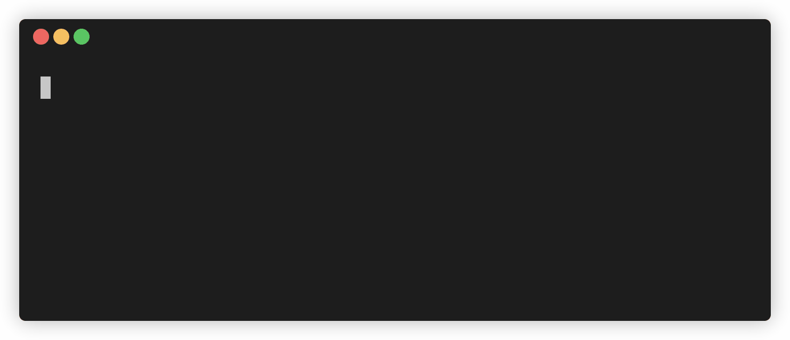

# garson

[](https://travis-ci.org/goliney/garson)
[](https://www.npmjs.com/package/garson)

Interactive config-based command line tool

## Install

```shell script
npm install -g garson # needed for binary
npm install garson # needed for config file
```
Alternatively, if you don't want to install the package locally, you can add global modules path to
NODE_PATH ([link](https://stackoverflow.com/a/43504699/1065780)):
```shell script
export NODE_PATH=$(npm root --quiet -g)
```

## Usage
Run:
```shell script
garson
```
This command will look for `garson.config.js` file in the current directory.
You can change the default path with `--config` option.

See `garson --help` for a full list of options.

## Examples

### Input

```js
// garson.config.js
const { garson, prompts, actions } = require('garson');

module.exports = garson()
  // first prompt
  .prompt(
    'firstName',
    prompts.input({
      message: "What's your first name?",
      placeholder: 'E.g. John',
    })
  )
  // second prompt
  .prompt(
    'lastName',
    prompts.input({
      message: "What's your last name?",
      placeholder: 'E.g. Smith',
    })
  )
  // final action
  .action(results => {
    const { firstName, lastName } = results;
    actions.printMessage({ message: `Hello, ${firstName} ${lastName}` });
  });
```

### Fuzzy path search

```js
// garson.config.js
const { garson, prompts, actions } = require('garson');

module.exports = garson()
  .prompt(
    'file',
    prompts.fuzzyPath({
      message: 'Enter file:',
      root: '/Users/goliney/Workspace/garson/src',
      filter: node => !node.isDir,
    })
  )
  .action(results => {
    const { file } = results;
    actions.spawn(`wc ${file.path}`);
  });
```

### Choices

```js
// garson.config.js
const { garson, prompts, actions } = require('garson');

module.exports = garson()
  .prompt(
    'command',
    prompts.choices({
      message: 'What git command you want to run?',
      items: [
        { label: 'See current branch', value: 'git branch' },
        { label: 'Checkout to master', value: 'git checkout master' },
        { label: 'See status', value: 'git status' },
      ],
    })
  )
  .action(results => {
    const { command } = results;
    actions.spawn(command, { showCommand: true });
  });
```

### Multi choices

```js
// garson.config.js
const { garson, prompts, actions } = require('garson');

module.exports = garson()
  .prompt(
    'wcOptions',
    prompts.multiChoices({
      message: 'What do you want to count in garson.config.js file?',
      items: [
        { label: 'Lines', value: 'l', isSelected: true },
        { label: 'Words', value: 'w', isSelected: true },
        { label: 'Characters', value: 'm' },
      ],
    })
  )
  .action(results => {
    const { wcOptions } = results;
    const options = wcOptions.length ? `-${wcOptions.join('')}` : '';
    actions.spawn(`wc ${options} garson.config.js`);
  });
```
